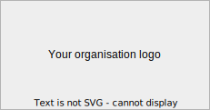

# Welcome to SWORDS

Welcome to the **S**can and revie**W** of **O**pen **R**esearch **D**ata and **S**oftware (**SWORDS**) project. The SWORDS project is a powerful framework to gain insights in the open source activities of your, but not limited to, university or research institute. This repository is the start of your own implementation for your organisation! Read this part carefully. For any questions, please use the [issue tracker](https://github.com/UtrechtUniversity/SWORDS-template/issues). 

This repository consists of 2 parts, the instruction and the template. The instruction is what you are reading right now, the template starts after `<<< The template starts here >>>` below. To implement the SWORDS framework to your organisation easily, we recommend to make use of the template function in GitHub. The instruction below helps you to implement SWORDS for your organisation in step-by-step manner. 

## Getting started with SWORDS

1. Define a name for your project. The recommended name is SWORDS@{INSERT YOUR ORGANISATION NAME ABBRAVATION}. 
2. [Create a repository from the SWORDS template](https://docs.github.com/en/repositories/creating-and-managing-repositories/creating-a-repository-from-a-template) with the name as defined in step 1. 
3. Replace all fields in the README of your repostitory starting with `{INSERT ...}` by your details of your project and organisation. Use search `{INSERT`, because some can be harder to find. 
4. Delete in this README everything between `<!-- REMOVE EVERYTHING BEFORE THIS LINE IN STEP 4 -->`. 

## <<< The template starts here >>>
<!-- REMOVE EVERYTHING BEFORE THIS LINE IN STEP 4 -->

# SWORDS@{INSERT YOUR ORGANISATION NAME ABBRAVATION}


This repository implements for the [**S**can and revie**W** of **O**pen **R**esearch **D**ata and **S**oftware (SWORDS)](https://github.com/UtrechtUniversity/SWORDS-template) framework. SWORDS is a powerful tool to gain insights in the open source activities of your, but not limited to, university or research institute. Studies show that open source contributions can be very benificial for organisations and society. SWORDS is divided into 3 stages that can be exectued and analyzed standalone: finding user profiles associated to your organisation, extract relevant repositories, and study the contents of the respositories. 

<p align="center">
  This repository is an implementation of SWORDS for <b>{INSERT YOUR ORGANISATION NAME}</b>.
   <!-- For example Utrecht University -->
</p>
<p align="center">
  <b>SWORDS@{INSERT YOUR ORGANISATION NAME ABBRAVATION}</b>
  <!-- For example SWORDS@UU -->
</p>

<p align="center">
  
</p>

## Background

Conducting science in an open and collaborative way is very important for greater scientific and societal impact (https://www.nwo.nl/en/open-science). The Open Science movement is therefore actively promoting and advancing openness in academic publications, data, software, and other types of output. Major steps have been taken in the last years, however, there is still a lot to improve and win. A result of this movement towards more open research output is the increase of code and software published by researchers on online platforms. The use and reuse of open source (research) software and code is widespread nowadays. 

For (research) organisations, it can be interesting to have insights into the contributions and activities in open source software projects. Especially because activities of members, researchers, or employees can be divided over multiple user profiles and platforms (e.g. GitHub and GitLab). Having an overview of the activity, contents, and quality can be useful for various reasons like connecting initiatives, improve quality, and reward and recognize contributions. The SWORDS framework was introduced to help with collecting insights and assessing quality. 

<!-- Introduce FAIR -->

## The SWORDS framework


- Its goal is to analyze the FAIRness of GitHub repositories of {INSERT YOUR ORGANISATION NAME} researchers and see how they develop and manage software. The purpose of this research is to serve as a template for other researchers to scan and review repositories for their organisation as well.


The SWORDS framework consists of three mostly-independent steps. Each step is described below and detailed information and instructions can be found in the links. 

1. **[Find user profiles associated to organisation](collect_users/)**. In this first step of the framework, multiple strategies are available to find users on GitHub and GitLab that are members or employees of your organisation. By using multiple collection strategies, the recall is considered to be high. The findability of members or employees is one of the output variables of this step. A structured list of users is used as input for the next step.
2. **[Collect relevant repositories](collect_repositories/)**. In the second step, the repositories of the users collected in the previous step are collected and filtered. Not all repositories are research output. These repositories are filted out automatically and/or manually.
3. **[Study and analyze repositories](collect_variables/)**. In this step, further variables of research repositories are gathered. These are then examined and studied on various quantitiative and qualitative properties. One can think about quality assesments, documentation availablity, FAIRness scores. 

<p align="center">
  
</p>

The SWORDS framework is written in Python 3.6+. The SWORDS framework implements the reproducible project structure as proposed by [Wilson et al. (2017)](https://journals.plos.org/ploscompbiol/article?id=10.1371/journal.pcbi.1005510) for each step of the framework. For more information about the phases, please look into the corresponding subfolders for further information on installation and usage. All output data is stored in output folders. There is also a corresponding interactive data analysis jupyter notebook file in each step. This notebook can be used for results. 

## Results

The results of the three steps of the SWORDS framework can be found in each of the subfolders of the project. Each step contains a Jupyter notebook with results, code, and narrative. Output data files can be found in the output folder in each step.  

Results of step 1: **Find user profiles associated to organisation**
- :open_book: [Analysis (Jupyter notebook)](collect_users/analyze_users.ipynb) &nbsp; &nbsp; &nbsp; &nbsp; &nbsp; :inbox_tray: [Input data](collect_users/methods) &nbsp; &nbsp; &nbsp; &nbsp; &nbsp; :outbox_tray: [Results (data)](collect_users/results) 

Results of step 2: **Collect relevant repositories**
- :open_book: [Analysis (Jupyter notebook)](collect_repositories/analyze_repositories.ipynb) &nbsp; &nbsp; &nbsp; &nbsp; &nbsp; :inbox_tray: [Input data](collect_users/results) &nbsp; &nbsp; &nbsp; &nbsp; &nbsp; :outbox_tray: [Results (data)](collect_repositories/results) 

Results of step 3: **Study and analyze repositories**
- :open_book: [Analysis (Jupyter notebook)](collect_variables/analyze_metrics.ipynb) &nbsp; &nbsp; &nbsp; &nbsp; &nbsp; :inbox_tray: [Input data](collect_repositories/results) &nbsp; &nbsp; &nbsp; &nbsp; &nbsp; :outbox_tray: [Results (data)](collect_variables/results) 

## Usage

In the normal use case, you start with phase 1 and go through each phase as the output of phase 1 can be used for phase 2. However, if you already have collected a list of users for example, you can skip phase 1 and use that collected list as input for phase 2. Since the phases are independent of each other, this approach is possible. For details on how to execute each phase, look into the corresponding subfolder.

## Citation

Use this citation for citing the SWORDS implementation of {INSERT YOUR ORGANISATION NAME}.
```
{INSERT CITATION DETAILS}
```

To cite the SWORDS project and the SWORDS template, use 

```
@software{de_Bruin_Scan_and_revieW_2022,
author = {de Bruin, Jonathan and Quach, Keven and Slewe, Christopher and Lamprecht, Anna-Lena},
month = {2},
title = {{Template of Scan and revieW of Open Research Data and Software}},
url = {https://github.com/UtrechtUniversity/SWORDS-template},
version = {1.0.0},
year = {2022}
}
```

## License

The SWORDS project template is published under the [MIT License](/license).

Icons of the banner are made by [Freepik](https://www.freepik.com "Freepik") from [www.flaticon.com](https://www.flaticon.com/ "Flaticon").

## Contact

For contact about this implementation of the SWORDS project, SWORDS@{INSERT YOUR ORGANISATION NAME ABBRAVATION}, post an issue on the [issue tracker](../../issues) or contact {INSERT YOUR EMAIL}. 

For general questions and remarks about the SWORDS project and the template can be posted on the [issue tracker of the SWORDS template](https://github.com/UtrechtUniversity/SWORDS-template/issues). You can also contact either [Jonathan de Bruin](https://github.com/J535D165) or [Keven Quach](https://github.com/kequach). 

The SWORDS project is an idea of the FAIR Data and Software working group of the [Utrecht University Open Science Programme](https://www.uu.nl/en/research/open-science).
