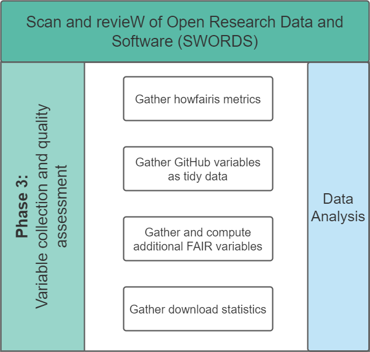

# Summary

The SWORDS (Scan and revieW of Open Research Data and Software) project is a powerful, open-source framework designed to provide insight into an organization's open-source activities. This comprehensive tool offers a structured approach for organizations such as universities and research institutes to evaluate their contributions to the open-source community. The framework is divided into three core stages that can be executed independently:

1. Finding user profiles associated with an organization.  
   {width=50%}
2. Extracting relevant repositories.  
   {width=50%}
3. Studying the contents of the repositories. Content evaluation includes aspects of quality assessment, documentation availability, and FAIRness scores (Findability, Accessibility, Interoperability, and Reusability) [@wilkinson_fair_2016].  
   {width=50%}

Written in Python, the SWORDS project provides a template for easy implementation within any organization and focuses on GitHub, which is the go-to reference for mining open-source repositories [@cosentino_systematic_2017]

# Statement of need

Open Science, promoting transparency in academic publications, data, software, and other types of output, is crucial for enhancing scientific and societal impact in today's research climate. The application of Open Science principles to research data and software is vital for ensuring scientific integrity and reproducibility, which can sometimes be lackluster [@allison:2016]. However, substantial challenges persist in tracking, managing, and understanding open-source research software due to the scattered and fragmented nature of these activities across multiple platforms [@lamprecht_towards_2020].

The SWORDS framework addresses this need by providing a systematic approach to collating, analyzing, and understanding an organization's open-source research software. The insights gained from implementing SWORDS can help organizations connect initiatives, improve quality, reward and recognize contributions, and foster a collaborative and open research environment. Thus, SWORDS presents an invaluable tool for any research organization aiming to improve its open-source activities and drive forward the principles of Open Science.

# Acknowledgements

<!-- Either use acknowledgement or add Chris as an author -->
We acknowledge contributions from Christopher Slewe during the genesis of this project.

# References