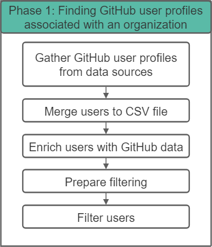
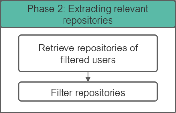

# Summary

SWORDS (Scan and revieW of Open Research Data and Software) is a framework designed to provide insights into an organization's, as well as their members open-source activities, through a structured approach. The framework focuses on organizations within the research domain by taking academic publishing principles into account. A big challenge for such a framework lies in the decentralization of open-source activities. It is divided into three core stages that can be executed independently:

1. Finding GitHub user profiles associated with an organization.  
   {width=45%}
2. Extracting relevant repositories.  
   {width=45%}
3. Studying the contents of the repositories. Content evaluation includes aspects of quality assessment, documentation availability, and FAIRness [@wilkinson_fair_2016] scores [@Spaaks_howfairis_2022] (Findability, Accessibility, Interoperability, and Reusability).  
   {width=50%}

To illustrate, an organization that already has collected the GitHub user profiles does not need to execute phase 1. An organization that is only interested in collecting the GitHub user profiles does not need to execute the following phases. An organization that has already collected relevant repositories does not need to execute phases 1 and 2.

In the past, research organizations had insufficient tooling for the analysis of research output like software and data. Over the years, many initiatives were introduced and especially the introduction of the FAIR principles contributed to an improvement of available tools [@Barker2022]. This enabled us to have a better understanding of the publication principles for transparent and reproducible publication of data and software that is also quantifiable through monitoring and evaluation. These insights can be useful as described in the [statement of need](#statement-of-need).

Written in Python, SWORDS provides a template for easy implementation within any organization and focuses on GitHub, which is the go-to reference for mining open-source repositories [@cosentino_systematic_2017]. It is designed to be extensible and flexible, which allows to evaluate repositories on custom-defined metrics and collect users according to different strategies. The framework was applied to Utrecht University as part of a research project [@quach_mapping_2022]. The results of the aforementioned research project were presented at a conference [@quach_keven_2023_8150215]. Ongoing research projects are currently being conducted at the University of Potsdam. There are also related open source program office (OSPO) tools, which do not fit the academic use-case yet.

# Statement of need

Open Science, promoting transparency in academic publications, data, software, and other types of output, is crucial for enhancing scientific and societal impact in today's research climate. The application of Open Science principles to research data and software is vital for ensuring scientific integrity and reproducibility, which can sometimes be lackluster [@allison:2016]. However, substantial challenges persist in tracking, managing, and understanding open-source research software due to the scattered and fragmented nature of these activities across multiple platforms [@lamprecht_towards_2020].

The SWORDS framework addresses this need by providing a systematic approach to collating, analyzing, and understanding an organization's open-source research software. The insights gained from implementing SWORDS can help organizations connect initiatives, improve quality, reward and recognize contributions, and foster a collaborative and open research environment. Thus, SWORDS presents an invaluable tool for any research organization aiming to improve and better understand its open-source activities and drive forward Open Science.

# Acknowledgements

We acknowledge contributions from Christopher Slewe during the genesis of this project. We also acknowledge the funding programs: The Open Science Programme (OSP) and FAIR Research IT.

# References
